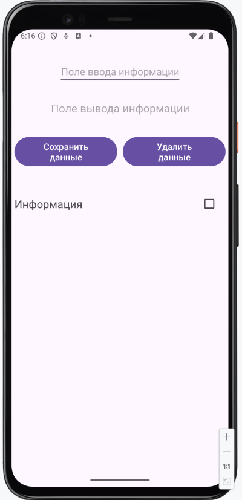
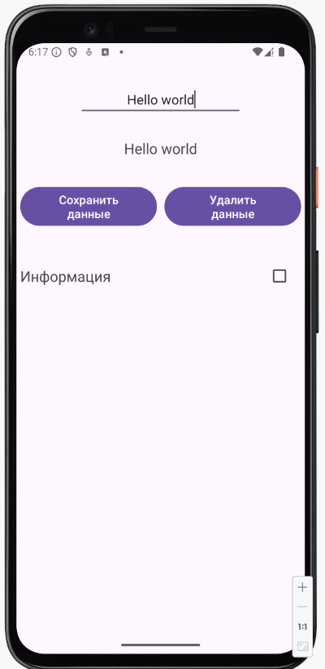
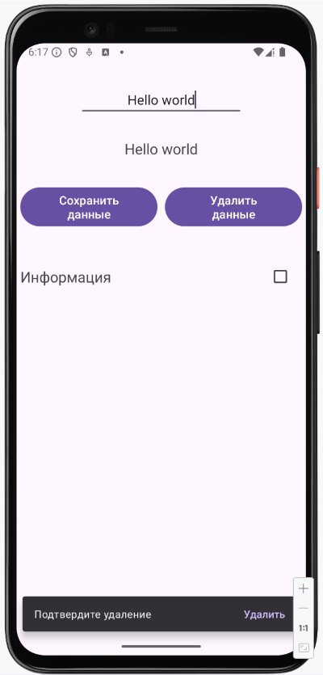
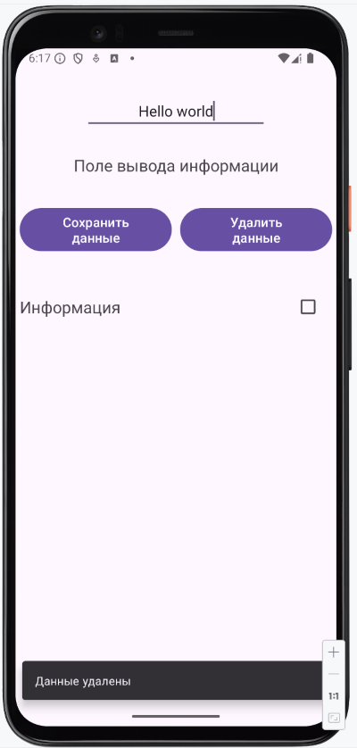
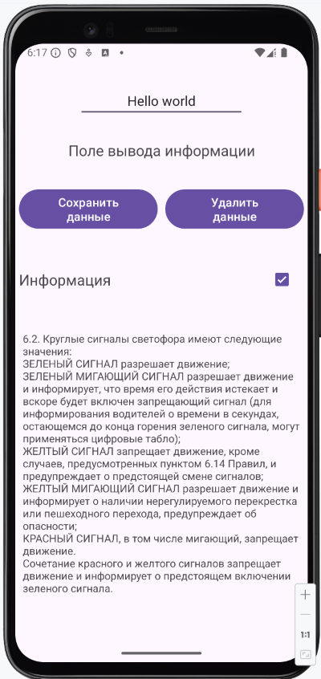
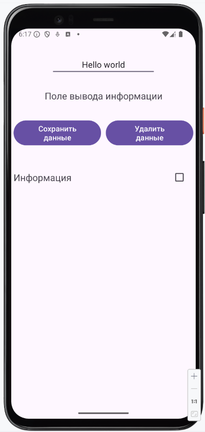

# Домашнее задание Checkbox, Snackbar

1. Написать программу, в которой существует два поля на экране:

   1 - Поле ввода информации,
   2 - Поле вывода информации.

   Есть две кнопки:

   1 - Кнопка **«Сохранить данные»** - при ее нажатии данные с поля ввода текста – `EditText`
   переносятся в поле вывода – `TextView`.

   2 - Кнопка **«Удалить данные»** - при ее нажатии появляется виджет **«Подтвердите удаление»**,
   этому виджету добавлено действие **«Удалить»**. При выборе действия виджета **«Удалить»** поле
   вывода очищается, создается Snackbar **«Данные удалены»**.

2. Написать программу **«Правила дорожного движения»**.

   Создать `Checkbox` и пустое текстовое поле этого `Checkbox` с текстом **«Информация»**. В случае
   постановки
   флажка в checkbox текст в поле «Информация» меняется на **«Правила дорожного движения»** и в
   текстовом
   поле ниже checkbox появляются несколько пунктов правил дорожного движения.

Каждую из задач сохранить проектом в удаленном репозитории, для проверки качества предоставить
ссылку преподавателю, либо сделать сканы по каждому пункту выполнения задачи в процессе работы
приложения, заархивировать и прислать на проверку.

### Скриншоты домашнего задания

Скриншоты здесь

